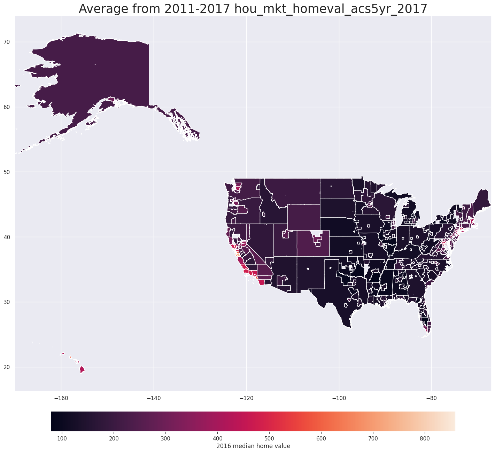
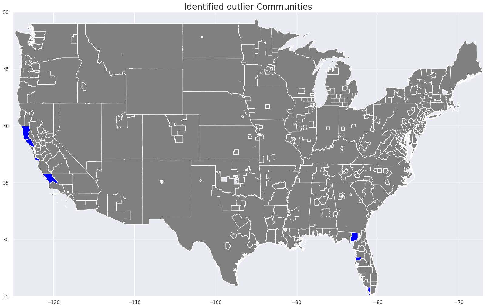
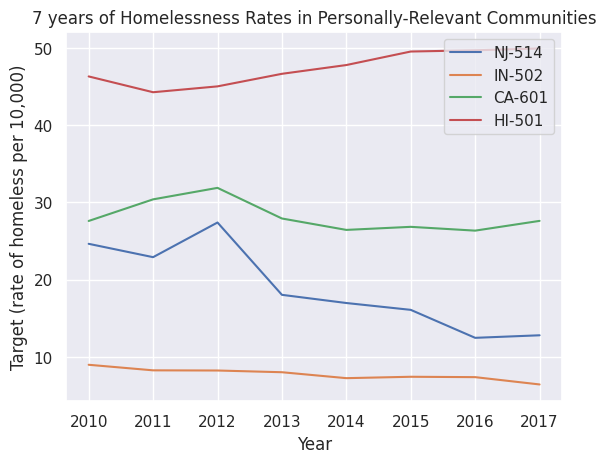
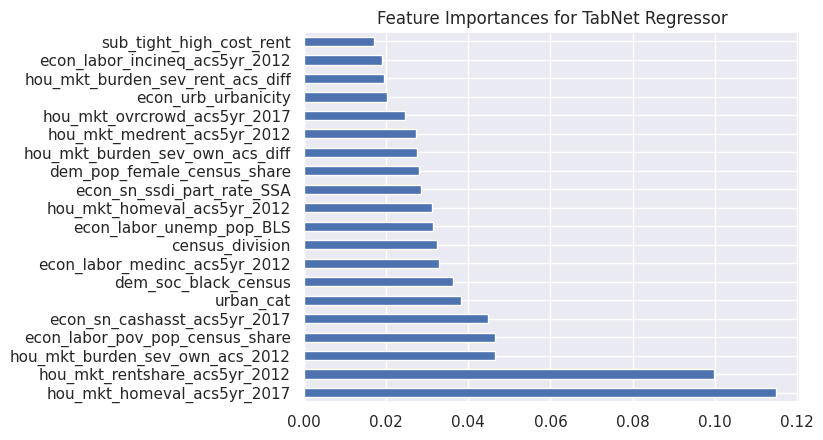

<!-- Add banner here -->

# Predicting Rates of Homelessness in U.S. Communities

<!-- Add buttons here -->

<!-- Describe your project in brief -->
The application of modern data science models allows for greater complexity in analysis of the factors that may predict homelessness. I propose that by understanding the complex relationships that rates of homelessness hold with a variety of factors through examining how machine learning models predict rates of homelessness, decisions in policy and homeless support can be made with greater confidence and effectiveness.

To accomplish this, I apply:
- hyper parameter tuned regularized linear regression models
- TabNet (a deep neural network of tree-based algorithms) ([**source**](https://paperswithcode.com/paper/tabnet-attentive-interpretable-tabular))

Ultimately, 
- I explain 76% of the variance in rates of homelessness over the baseline linear regression’s 54%. 
- TabNet’s feature importances are different from the linear models, and provide interesting insights as to the complex relationships that contribute to rates of homelessness. 
    - Particularly, the features with the highest predictive power were determined to be the median home value from 2016, the 2011 share of renters, the 2011 percentage of homeowners with severe cost burden, and the rate of poverty.

# Description of Files

The most relevant files to this project are:
- `predicting_homelessness.ipynb`: the jupyter notebook that contains the analysis and sufficient explanations.
- `predicting-homelessness-writeup.pdf`: the no-code writeup. Containing the story of all decisions made along this project's completion.

# Sneak Peak
<!-- Add a demo for your project -->

Inspecting the notebook `predicting_homelessness.ipynb` is the best way to inspecting this project; however, below are a few sneak-peaks into the figures output.

This is a visualization of the dependent varable. The rate of homelessness in difference U.S. communities.

These are the outlier communities, with high rates of homelessness.

Time series modeling.

TabNet's feature importances.

# License

[GNU General Public License version 3](https://opensource.org/licenses/GPL-3.0)
